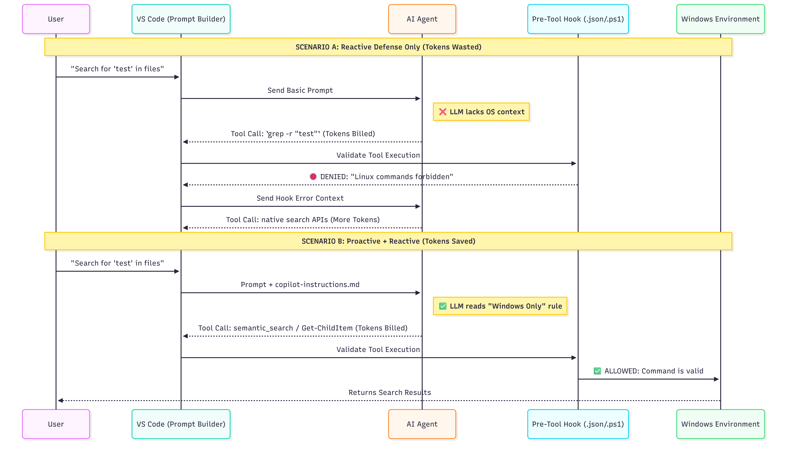

# Taming AI Agents

A collection of practical configurations, custom instructions, and guardrails designed to optimize AI coding agents (like GitHub Copilot) for specific development environments.

## The Goal
AI agents are incredibly powerful, but they often suffer from "default bias"—instinctively reaching for Linux-based tools or general-purpose strategies even when they aren't appropriate for your specific local setup.

This repository is a living document of my personal discoveries, trial-and-error tests, and "happy accidents" found while working with AI agents in the trenches of full-stack development. It isn't a definitive guide; it's a collection of notes and tools that work for me, shared in the hope they might help or inspire your own setup.

## Repository Structure

- [**windows-environment-amnesia**](./windows-environment-amnesia/): Strategies and hooks to prevent AI agents from defaulting to Linux commands (`grep`, `sed`, `rm -rf`) in a native Windows 11 / PowerShell environment.

## How to Use This Repo
1. **Browse** the folders for the specific problem you are facing.
2. **Review** the `copilot-instructions.md` or hook scripts.
3. **Adapt** them to your local environment (paths, regex patterns, etc.).

## Contributing
If you've found a more elegant way to keep your agents in line, or if you've discovered a strategy for a different environment (WSL2, MacOS, etc.), feel free to open a PR or start a discussion. I'm always looking to learn and improve my setup.

---
*Note: The ideas and problem statements here are born from real-world development friction. While AI helps me polish the documentation, the "gore" in the logs is 100% mine.*