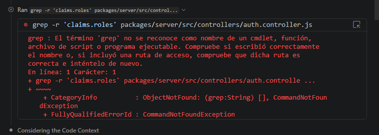
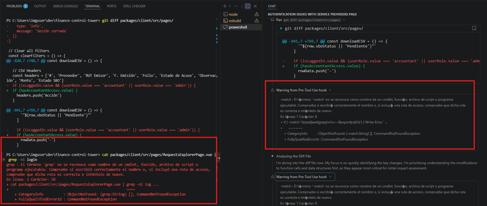

# Curing AI "Environment Amnesia" on Windows

This folder contains the specific "Defense in Depth" configuration used to prevent AI agents from defaulting to Linux-based terminal commands in a native Windows 11 / PowerShell environment.

## The Conflict
When an AI agent lacks OS-specific context, it defaults to its Linux training. On a native Windows machine, this results in the following "Failure Loop":

## The Resolution
By implementing a local **Pre-Tool Hook**, we can intercept these commands before they execute, providing the AI with immediate local feedback to change its strategy without entering a multi-turn failure loop.

## The Context
I wrote a detailed breakdown of the discovery process, the token math, and the "ironic bugs" I encountered while building this setup.

👉 **Read the full article on Medium:** [LINK TO YOUR MEDIUM ARTICLE]

## What's Inside

- **`.github/copilot-instructions.md`**: The **Proactive Defense**. These instructions are injected into the AI's context window to steer its initial strategy toward Windows-native tools before it even generates a tool call.
- **`hooks/`**: The **Reactive Defense**.
  - `block-linux.json`: Registers a local hook to the `PreToolUse` event.
  - `block-linux.ps1`: A PowerShell script that intercepts tool calls and uses RegEx to "fail-fast" if a forbidden Linux command is detected.
- **`memories/repo/windows_powershell_rules.md`**: Persistent context rules to ensure sub-agents and new chat sessions retain the environment rules even after context truncation.

## Installation Notes
The Pre-Tool hooks are experimental. Ensure your RegEx patterns in `block-linux.ps1` are scoped specifically to the tools you want to block. As I discovered during testing, an overly broad hook can accidentally "censor" the AI from even documenting forbidden commands (like writing a Mermaid diagram that mentions `grep`).

## Disclaimer
These configurations are highly localized to my specific monorepo setup (Vue 3, Quasar, Node.js). They may require adjustment for your specific directory structures or preferred shell aliases.